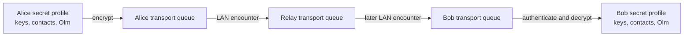

<!-- SPDX-License-Identifier: CC-BY-SA-4.0 -->

<div align="center">

# Lantern

**Экспериментальный мессенджер для доставки сообщений без интернета и постоянной инфраструктуры**

[](SECURITY.md)
[](apps/lantern-cli/README.md)
[](rust-toolchain.toml)
[](PRIVACY.md)

</div>

> [!WARNING]
> Lantern пока нельзя использовать для реальной экстренной или опасной
> переписки. Проект не проходил независимый аудит безопасности.

## О проекте

Lantern исследует доставку коротких личных сообщений в ситуациях, когда
интернет, мобильная сеть или отдельные серверы недоступны. Устройства передают
зашифрованные контейнеры при встрече в локальной сети и могут временно хранить
их для других участников.

Базовый сценарий v0.1 выглядит так:

```text
Alice -> Relay -> Bob
```

Alice и Bob не соединяются напрямую. Relay помогает доставить сообщение позже,
но не получает профиль пользователя, пароль или ключи переписки. При взломе
Relay противник всё ещё сможет видеть маршрутные метаданные, задерживать и
удалять контейнеры или пытаться отправлять старые копии.

Lantern не требует номер телефона или электронную почту, не отправляет
телеметрию и не использует собственные криптографические алгоритмы.

## Что уже работает

Lantern v0.1 доведён до состояния `experimental preview`:

- три отдельных Linux-процесса проводят сообщение по маршруту
  Alice -> Relay -> Bob;
- Alice и Bob создают контакт через два подписанных QR, сверяют SAS и
  устанавливают Olm-сессию;
- Relay хранит и пересылает только зашифрованный Envelope;
- сообщения, контакты и состояние ratchet хранятся в отдельной
  SQLCipher-базе;
- транспортная очередь переживает перезапуск и ограничена по числу объектов и
  размеру;
- TTL, hop limit, copy budget, дедупликация и reconnect проверяются отдельно;
- симулятор воспроизводимо сравнивает Direct Delivery, Epidemic и Binary
  Spray-and-Wait;
- негативные тесты покрывают replay, изменение защищённых полей, повреждённые
  пакеты, переполнение квот и откат времени.

Это рабочая исследовательская сборка, а не утверждение о безопасности или
готовности к повседневному использованию. Полный результат Этапа 4 находится в
[отчёте MVP](docs/reports/STAGE4_MVP_AUDIT.md).

## Архитектура



Криптографическое ядро не зависит от способа доставки. `lantern-crypto`
работает с контактами, Olm и защищёнными форматами, но не открывает сокеты.
Транспортный слой передаёт ограниченные непрозрачные байты и не получает
приватные ключи.

| Компонент | Назначение |
| --- | --- |
| `lantern-core` | Envelope, строгий CBOR, очередь, TTL и дедупликация |
| `lantern-crypto` | контакты, SAS, Olm и форматы защищённого payload |
| `lantern-secret-storage` | Argon2id, SQLCipher, ключи, ratchet и история |
| `lantern-transport` | общая ограниченная граница передачи кадров |
| `lantern-lan` | ручное LAN-соединение, framing и лимиты peer |
| `lantern-sync` | ограниченный обмен Offer, Request, Transfer и Done |
| `lantern-node` | жизненный цикл очереди, времени и диагностики |
| `lantern-bridge` | транзакционная граница между E2EE и открытой очередью |
| `lantern-cli` | минимальное Linux-приложение для демонстрации v0.1 |
| `simulator` | воспроизводимые эксперименты с маршрутизацией |

## Быстрый старт на Arch Linux

Установите системные зависимости и зафиксированный Rust toolchain:

```bash
sudo pacman -S --needed git rustup base-devel clang python

git clone https://github.com/sascka/lantern.git
cd lantern

rustup toolchain install 1.97.1 --profile minimal \
  --component clippy,rustfmt
cargo build -p lantern-cli --release --locked
./target/release/lantern-cli help
```

SQLCipher собирается через Clang. Причина фиксации C-компилятора описана в
[руководстве CLI](apps/lantern-cli/README.md).

Полный маршрут Alice -> Relay -> Bob требует нескольких терминалов. Все
команды, ожидаемый вывод и правила работы с тестовыми паролями находятся в
[DEMO.md](DEMO.md).

## Проверка проекта

Подготовьте отдельное окружение симулятора:

```bash
cd simulator
python -m venv .venv
.venv/bin/python -m pip install -r requirements-dev.txt
cd ..
```

После этого из чистого рабочего дерева запустите одну команду:

```bash
./scripts/verify-v0.1.sh
```

Она проверяет форматирование, запускает Clippy с `-D warnings`, собирает
release-версию CLI и выполняет весь набор Rust- и Python-тестов. Последняя
проверка Этапа 4 прошла для 278 Rust-тестов и 141 теста симулятора.

## Границы v0.1

В первую версию входят:

- короткие личные сообщения один-к-одному;
- Linux CLI;
- доставка по локальной сети через один недоверенный Relay;
- обязательное E2EE;
- ручное добавление контакта с очной SAS-проверкой;
- ограниченное локальное хранение и восстановление после перезапуска;
- воспроизводимый симулятор маршрутизации.

В v0.1 не входят Android, группы, карты, SOS, интернет-реле, Tor, BLE,
Wi-Fi Direct, Meshtastic, автоматическое обнаружение соседей, GUI и
восстановление ключей. Точные границы и критерии готовности записаны в
[MVP.md](MVP.md).

## Структура репозитория

```text
apps/                 Linux CLI
crates/               Rust-библиотеки Lantern
simulator/            Python-симулятор и результаты экспериментов
experiments/          проверки совместимости зависимостей
docs/adr/             принятые архитектурные решения
docs/reports/         отчёты по завершённым этапам
scripts/              воспроизводимые команды проверки
```

## Документация

Для знакомства с проектом достаточно начать с этих файлов:

1. [VISION.md](VISION.md) - цель и принципы Lantern.
2. [MVP.md](MVP.md) - границы первой версии.
3. [THREAT_MODEL.md](THREAT_MODEL.md) - противники, защищаемые данные и
   ограничения.
4. [PROTOCOL.md](PROTOCOL.md) - формат Envelope, лимиты и состояния.
5. [ROADMAP.md](ROADMAP.md) - этапы разработки и критерии перехода.
6. [SECURITY.md](SECURITY.md) - правила безопасной разработки и честные
   ограничения.
7. [DEMO.md](DEMO.md) - последовательная демонстрация на Linux.

Подробные решения по криптографии, хранению, LAN и синхронизации находятся в
[docs/adr](docs/adr). Если реализация расходится со спецификацией или моделью
угроз, это считается ошибкой, даже когда обычный сценарий продолжает работать.

## Безопасность и приватность

- Все входящие сетевые данные считаются недоверенными.
- Сообщения, пароли и приватные ключи не должны попадать в логи.
- Квоты проверяются до чтения или выделения больших объёмов памяти.
- Ошибка аутентификации не должна фиксировать кандидатное состояние ratchet.
- Неверное время устройства может преждевременно удалить сообщение.
- Взлом Relay не раскрывает открытый текст, но раскрывает часть метаданных и
  позволяет мешать доставке.
- Автоматические тесты не заменяют криптографический аудит.

Подробности находятся в [THREAT_MODEL.md](THREAT_MODEL.md),
[PRIVACY.md](PRIVACY.md) и [SECURITY.md](SECURITY.md).

## Участие в разработке

Перед изменением кода прочитайте [CONTRIBUTING.md](CONTRIBUTING.md). Один pull
request должен решать одну связанную задачу, содержать необходимые тесты и
объяснять влияние на модель угроз. Правила общения находятся в
[CODE_OF_CONDUCT.md](CODE_OF_CONDUCT.md).

## Лицензии

В репозитории используются разные лицензии для разных частей проекта:

- приложения и будущий интернет-реле - `AGPL-3.0-or-later`;
- Rust-библиотеки и симулятор - `MPL-2.0`;
- спецификация протокола - `CC-BY-4.0`;
- остальная документация - `CC-BY-SA-4.0`.

Полные тексты и правила для зависимостей находятся в
[LICENSES.md](LICENSES.md) и [THIRD_PARTY_NOTICES.md](THIRD_PARTY_NOTICES.md).
