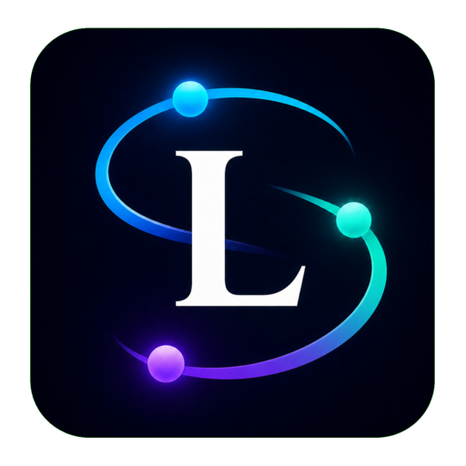
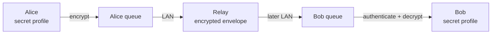

<!-- SPDX-License-Identifier: CC-BY-SA-4.0 -->

<div align="center">



# Lantern

**Короткие личные сообщения без интернета и постоянной инфраструктуры**

[](SECURITY.md)
[](apps/lantern-cli/README.md)
[](rust-toolchain.toml)
[](PRIVACY.md)

[](DEMO.md)
[](SECURITY.md)
[](LICENSES.md)

</div>

> [!WARNING]
> Lantern пока нельзя использовать для реальной экстренной или опасной
> переписки. Проект не проходил независимый аудит безопасности.

## Что такое Lantern

Lantern исследует доставку сообщений в ситуациях, когда интернет, мобильная
сеть или отдельные серверы недоступны. Устройства встречаются в локальной сети,
обмениваются ограниченными зашифрованными контейнерами и могут временно хранить
их для других участников.

<table>
<tr>
<td width="33%" align="center"><b>Без интернета</b><br><sub>Сообщение может пройти через устройство-посредник и пережить перезапуск.</sub></td>
<td width="33%" align="center"><b>Сквозное шифрование</b><br><sub>Relay не получает профиль пользователя, пароль или ключи переписки.</sub></td>
<td width="33%" align="center"><b>Без обязательного аккаунта</b><br><sub>Номер телефона и электронная почта не используются как идентичность.</sub></td>
</tr>
</table>

## Как проходит сообщение



Alice и Bob не соединяются напрямую. Relay видит часть маршрутных метаданных и
может задержать или удалить контейнер, но в рамках модели угроз у него нет
ключей для открытия сообщения. Криптографическое ядро отделено от транспорта:
сеть передаёт непрозрачные байты и не работает с приватными ключами.

## Что готово в v0.1

- полный маршрут Alice -> Relay -> Bob в трёх отдельных Linux-процессах;
- контакт через два подписанных QR, SAS-проверку и Olm-сессию;
- SQLCipher-хранилище для ключей, контактов, ratchet и истории;
- постоянная транспортная очередь с TTL, hop limit, copy budget и
  дедупликацией;
- воспроизводимый симулятор Direct Delivery, Epidemic и Binary Spray-and-Wait;
- 278 Rust-тестов и 141 тест симулятора, включая негативные сценарии.

Текущая версия остаётся `experimental preview`. Подробный результат находится
в [отчёте Этапа 4](docs/reports/STAGE4_MVP_AUDIT.md).

## Быстрый старт на Arch Linux

```bash
sudo pacman -S --needed git rustup base-devel clang python
git clone https://github.com/sascka/lantern.git
cd lantern

rustup toolchain install 1.97.1 --profile minimal \
  --component clippy,rustfmt
cargo build -p lantern-cli --release --locked
./target/release/lantern-cli help
```

Полная демонстрация Alice -> Relay -> Bob находится в [DEMO.md](DEMO.md).
Она использует несколько терминалов и не требует соединения Alice с Bob.

<details>
<summary><b>Полная проверка проекта</b></summary>

```bash
cd simulator
python -m venv .venv
.venv/bin/python -m pip install -r requirements-dev.txt
cd ..

./scripts/verify-v0.1.sh
```

Скрипт проверяет форматирование, запускает Clippy с `-D warnings`, собирает
release-версию CLI и выполняет Rust- и Python-тесты.

</details>

## Документация

| Начать отсюда | Для чего нужен документ |
| --- | --- |
| [VISION.md](VISION.md) | цель и принципы Lantern |
| [MVP.md](MVP.md) | точные границы первой версии |
| [THREAT_MODEL.md](THREAT_MODEL.md) | противники, защищаемые данные и ограничения |
| [PROTOCOL.md](PROTOCOL.md) | Envelope, лимиты и состояния |
| [ROADMAP.md](ROADMAP.md) | этапы разработки |
| [CONTRIBUTING.md](CONTRIBUTING.md) | правила изменений и проверок |

Архитектурные решения находятся в [docs/adr](docs/adr), а подробные инструкции
по компонентам - рядом с соответствующими crate.

## Безопасность

Все входящие данные считаются недоверенными. Сообщения, пароли и приватные
ключи не должны попадать в логи. Квоты проверяются до больших чтений и
выделений памяти. Автоматические тесты не являются доказательством безопасности
и не заменяют аудит.

Угрозы и известные ограничения описаны в
[THREAT_MODEL.md](THREAT_MODEL.md), [PRIVACY.md](PRIVACY.md) и
[SECURITY.md](SECURITY.md).

## Лицензии

[](LICENSES/MPL-2.0.txt)
[](LICENSES/AGPL-3.0-or-later.txt)
[](LICENSES/CC-BY-4.0.txt)

Полная схема лицензирования и уведомления о зависимостях находятся в
[LICENSES.md](LICENSES.md) и [THIRD_PARTY_NOTICES.md](THIRD_PARTY_NOTICES.md).
